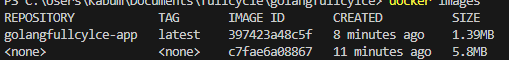
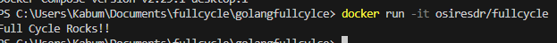

# Desafio Pratico: Otimização de Imagem FullCycle 3.0

# Desafio

1 - Temos que ter o seguinte resultado: Full Cycle Rocks!!

2 - A imagem de nosso projeto Go precisa ter menos de 2MB 


## Images






## Executar Imagem

```
docker run osiresdr/fullcycle:latest
```	
